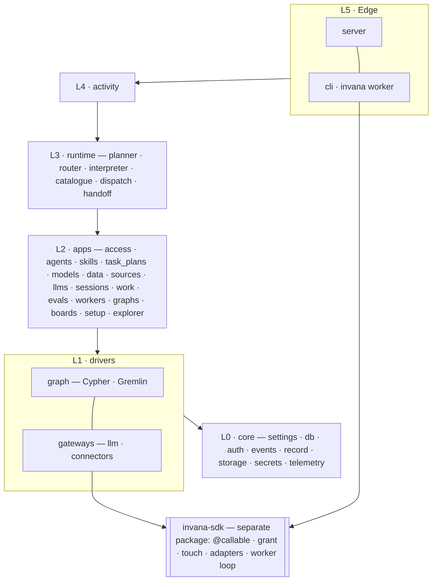
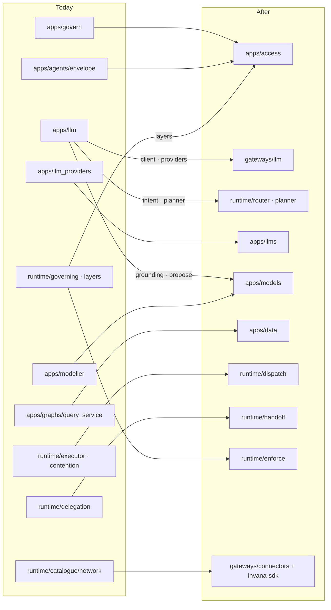
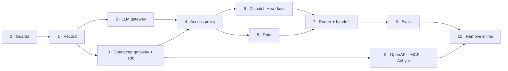

# Engine migration plan — to the agent system design

How the engine's code moves from today's tree to the one [system-design.md](system-design.md) needs.

| | |
|---|---|
| Status | Plan. Nothing has moved. |
| Builds on | [`building-engine/migration-plan.md`](../for-developers/building-engine/migration-plan.md) — the six bands, and the shape inside a package (model · queryset · manager · schema). **That standard does not change.** This plan changes what sits in each band. |
| Size today | `engine/src/invana` — 71k lines. Largest: `runtime` 15.4k · `server` 8.9k · `apps/modeller` 7.6k · `graph` 6.7k · `apps/govern` 3.7k · `apps/llm` 2.8k |
| Before code | Each new package is a feature row in [`for-developers/README.md`](../for-developers/README.md) and a feature file first — the project's scope rule |

---

## 1. Principles

| Rule | Why |
|---|---|
| **Gateways first** | Trust and privacy both rest on one rule: every LLM call and every outside call passes one gateway. Nothing else is worth building until that holds |
| **Move, then change** | A package moves with a re-export at the old path, the tests stay green, and only then does its behaviour change. Never both in one step |
| **One package per step** | Each step is one PR, with the four guards from the current plan: import-linter, the engine suite, the golden files, `tsc` on Studio |
| **The API is additive until phase 4** | New endpoints only. Replacing lens and envelope with access policy is the first change Studio must follow, and it is planned as one |
| **A shim dies in the last phase** | Old import paths keep working until every caller has moved |

## 2. The bands, after



| L | Band | Changes |
|---|---|---|
| 0 | **core** | Gains `record/` (touches, artifact index), `storage/` (artifacts and dataset CSVs) and `secrets/` (credentials) |
| 1 | **graph** · **gateways** | `gateways/` is new, beside `graph/`: the only way out to an LLM or an outside source |
| 2 | **apps** | `govern` becomes `access`. New: `data`, `sources`, `evals`, `workers`. `modeller` becomes `models`; `llm_providers` becomes `llms`; `apps/llm` is split up |
| 3 | **runtime** | Gains `router/`, `dispatch/` (the durable queue), `handoff/`, `enforce/` |
| 4 | **activity** | Unchanged |
| 5 | **edge** | `server/access` replaces `server/govern`. New views for the new apps. `cli` gains `invana worker` |
| — | **invana-sdk** | A new pip package with no engine dependency, so a remote worker installs it without FastAPI or SQLAlchemy. The engine imports it |

## 3. The target tree

```
invana/                                  monorepo
├── engine/src/invana/
│   ├── core/                            L0 · infrastructure, no product rule
│   │   ├── settings.py · db.py · models.py · errors.py · utils.py
│   │   ├── migrations/                  alembic
│   │   ├── logging/ · telemetry/
│   │   ├── auth/                        identity — users, passwords, JWT, personal access tokens
│   │   ├── events/                      the append-only event record
│   │   ├── record/          NEW         touches · artifact index · who asked — one table per kind
│   │   ├── storage/         NEW         object storage: a local volume in dev, S3-compatible in prod
│   │   ├── secrets/         NEW         credentials, encrypted at rest — the only holder of keys
│   │   └── redaction.py                 what is never written down
│   │
│   ├── graph/                           L1 · the graph engine — unchanged, a published API
│   │   ├── connectors/                  base · cypher · gremlin
│   │   └── types/
│   │
│   ├── gateways/            NEW         L1 · every way out of the system
│   │   ├── llm/                         providers · client · pricing — records prompt, completion, what it was shown
│   │   │   └── providers/               anthropic · openai · ollama · claude_agent_sdk
│   │   └── connectors/                  engine side of the sdk gateway: plugs in secrets, storage, record, policy
│   │
│   ├── apps/                            L2 · one product idea each: models · querysets · managers · schemas
│   │   ├── access/          NEW         policies · attachments · grants · decisions — replaces govern + envelope
│   │   ├── agents/                      agents · soul · voice · bindings
│   │   ├── skills/                      skills · versions
│   │   ├── task_plans/                  plans · tasks · the DAG
│   │   ├── models/          RENAMED     graph models · versions · stitches · dataset + source schemas · mappings
│   │   ├── data/            NEW         datasets (CSV + DuckDB) · imports · graph reads · write stamps
│   │   ├── sources/         NEW         source connections · OpenAPI specs + operations · MCP servers + tools
│   │   ├── llms/            RENAMED     providers · models · roles (the cast)
│   │   ├── sessions/                    sessions · answers · citations
│   │   ├── work/                        projects · todos
│   │   ├── evals/           NEW         benchmarks · cases · scorecards · the publish gate
│   │   ├── workers/         NEW         workers · pools · enrolment · heartbeats
│   │   ├── graphs/                      the Graph · members · its graph-database connection
│   │   └── boards/ · setup/ · explorer/
│   │
│   ├── runtime/                         L3 · walking a plan
│   │   ├── router/          NEW         classify the ask · pick agent + skills · compose the answer
│   │   ├── planner/                     select · draft · validate against the grant
│   │   ├── interpreter/                 loop · suspend · bindings · lanes
│   │   ├── catalogue/                   declared callables, one file per bound + those workers declare
│   │   ├── dispatch/        NEW         the durable queue · leases · retries · pools · contention · cron
│   │   ├── handoff/         RENAMED     delegation: plan + context + budget slice, and the result back
│   │   ├── enforce/         RENAMED     ask access for a grant at each gate · sign it for the worker
│   │   ├── state/                       task_runs · prompts · artifacts · stream
│   │   └── canvas.py · projections.py · workflows.py · diagnosis.py · results.py
│   │
│   ├── activity/                        L4 · the tree · notifications — unchanged
│   ├── server/                          L5 · views + routes, one folder per product module
│   └── cli/                             L5 · start · migrate · loader · worker
│
├── sdk/                     NEW         pip install invana-sdk — no engine dependency
│   └── src/invana_sdk/
│       ├── callable.py                  @callable — args · outputs · bound · requires
│       ├── grant.py                     verify a signed grant; check a call's arguments against it
│       ├── touch.py                     build a touch; snapshot a response; upload both
│       ├── gateway.py                   the connector pipeline: check → credentials → call → touch → snapshot
│       ├── adapters/                    native_sql (postgres · snowflake) · http · web_search · openapi · mcp · airbyte
│       └── worker/                      lease from the queue · heartbeat · run a callable · report back
│
├── integrations/                        graph connectors — unchanged
└── studio/
```

## 4. Where today's code goes

### core

| Today | After | Change |
|---|---|---|
| `core/settings.py` · `db.py` · `models.py` · `errors.py` · `utils.py` | same | — |
| `core/migrations/` · `logging/` · `telemetry/` · `events/` | same | — |
| `core/auth/` | same | The membership check moves to `apps/access` in phase 4 — this closes the `auth → graphs` exception in import-linter |
| `core/querylog.py` | `core/record/` | Who asked a graph query becomes a kind of touch |
| `core/redaction.py` | same | Also applied by `core/record` before a payload is written |
| `apps/graphs/encryption.py` | `core/secrets/` | Credential encryption becomes the shared secret store |
| — | `core/record/` · `core/storage/` | New |

### graph and gateways

| Today | After | Change |
|---|---|---|
| `graph/connectors/` · `graph/types/` | same | — a published API in five pip packages |
| `graph/loaders/csv.py` | `apps/data/imports/` | Loading a CSV is an import, not a driver |
| `apps/llm/client.py` · `providers/` · `pricing.py` · `errors.py` · `defaults.py` | `gateways/llm/` | Move; then every call records prompt, completion and what it was shown |
| `runtime/catalogue/network.py` (body) | `gateways/connectors/` + `invana_sdk/adapters/` | `fetch_source` and `test_connection` go through the gateway |

### apps

| Today | After | Change |
|---|---|---|
| `apps/govern/addressing.py` | `apps/access/addressing.py` | The `<layer>/<sublayer>/<name>` grammar becomes the resource grammar |
| `apps/govern/rules.py` · `validate.py` · `catalogue.py` · `impact.py` | `apps/access/` | Rules become policy statements |
| `apps/govern/models` (lens · guardrail · world) · `query_lens.py` | `apps/access/legacy.py`, then deleted | Each lens compiles into policies in phase 4; retired in phase 10 |
| `apps/govern/cast.py` | `apps/llms/cast.py` | Role → model is model choice, not access |
| `apps/agents/envelope.py` | `apps/access/` | The envelope compiles into an agent's policy |
| `apps/agents/` (rest) | `apps/agents/` | — |
| `apps/llm/voice.py` | `apps/agents/voice.py` | Voice is part of the agent |
| `apps/llm/intent.py` · `clarify.py` | `runtime/router/` | Understanding the ask is routing |
| `apps/llm/planner.py` · `draft.py` | `runtime/planner/` | Drafting a plan is planning |
| `apps/llm/translate.py` | `runtime/catalogue/llm.py` (body) | A callable body |
| `apps/llm/propose.py` | `apps/models/propose.py` | Proposing a model is the modeler's skill |
| `apps/llm/grounding.py` | `apps/models/grounding.py` | Rendering the model for a prompt is model knowledge — and the privacy record names what it rendered |
| `apps/llm/schemas.py` | split, with the code that uses each shape | — |
| `apps/llm_providers/` | `apps/llms/` | Rename; API keys move into `core/secrets` |
| `apps/modeller/` | `apps/models/` | Rename. Gains dataset schemas, source schemas, mappings |
| `apps/modeller/database.py` | deleted | A re-export of `core.db` |
| `apps/graphs/query_service.py` | `apps/data/graph.py` | Graph reads become the data service; each read records what came back |
| `apps/graphs/` (rest) · `pool.py` · `compatibility.py` | `apps/graphs/` | — |
| `apps/sessions/` | `apps/sessions/` | Gains answers and citations |
| `apps/task_plans/` · `apps/skills/` · `apps/work/` · `apps/boards/` · `apps/setup/` · `apps/explorer/` | same | — |
| — | `apps/access/` · `apps/data/` · `apps/sources/` · `apps/evals/` · `apps/workers/` | New |

### runtime

| Today | After | Change |
|---|---|---|
| `runtime/planning.py` | `runtime/planner/` | Reads the grant from `apps/access`, not the envelope |
| `runtime/interpreter/` | same | — |
| `runtime/catalogue/` | same | The registry also lists callables workers declare and an admin enabled |
| `runtime/executor.py` · `contention.py` | `runtime/dispatch/` | Steps are queued and leased; today they run as asyncio tasks in the engine |
| `runtime/delegation.py` | `runtime/handoff/` | Rename; carries the budget slice and the child grant |
| `runtime/governing.py` | `runtime/enforce/` | Asks `apps/access` at each gate; signs the grant for the worker |
| `runtime/layers.py` | `apps/access/layers.py` | The seven layers are the policy vocabulary |
| `runtime/callers.py` | `core/record/` | With `querylog.py` |
| `runtime/models.py` · `managers/` · `querysets/` · `services.py` · `schemas.py` · `stream.py` | `runtime/state/` | Group, per the runtime-package plan |
| `runtime/emissions.py` · `results.py` · `diagnosis.py` · `canvas.py` · `projections.py` · `workflows.py` | same | — |
| — | `runtime/router/` · `runtime/dispatch/` | New |

### edge

| Today | After | Change |
|---|---|---|
| `server/govern/` | `server/access/` | **API change** — Studio's Govern screens follow (phase 4) |
| `server/modeller/` · `server/llm_providers/` | `server/models/` · `server/llms/` | Paths stay; folders follow the app |
| `server/*` (rest) | same | — |
| — | `server/data/` · `server/sources/` · `server/evals/` · `server/workers/` · `server/record/` | New — `server/record` serves touches and the LLM view |
| `cli/` | `cli/` | Gains `invana worker` |



## 5. Phases



| # | Phase | Moves | Done when |
|---|---|---|---|
| 0 | **Guards** | Empty packages for every new path; import-linter contracts for the new bands ([§6](#6-import-rules)) | The suite and import-linter are green with the new contracts in place |
| 1 | **Record** | `core/record` · `core/storage` · `core/secrets`; `querylog` and `callers` into the record | A graph query writes a touch with what came back |
| 2 | **LLM gateway** | `apps/llm` client and providers → `gateways/llm`; provider keys → `core/secrets` | **Privacy holds:** every prompt is recorded with what it was shown, and no code outside `gateways/llm` holds a provider key |
| 3 | **Connector gateway** | `sdk/` package; `gateways/connectors`; `fetch_source` through it; native Postgres, HTTP and web search adapters | **Trust holds for outside reads:** every outside call writes a touch and an artifact |
| 4 | **Access policy** | `apps/access`; lens and envelope compile into policies; `runtime/governing` → `runtime/enforce`; `server/govern` → `server/access` with Studio | Every gate asks `apps/access`; the lens and envelope tables are read only by `legacy.py` |
| 5 | **Data** | `apps/data`: dataset CSVs in object storage, DuckDB reads, imports, write stamps; `apps/modeller` → `apps/models` with dataset and source schemas and mappings | A dataset can be uploaded, mapped and imported, and every written record names its run |
| 6 | **Dispatch and workers** | `runtime/dispatch` on a Postgres queue; `apps/workers`; `invana worker`; signed grants | A step runs on a separate worker process, and a killed worker's step re-queues once |
| 7 | **Router and handoff** | `runtime/router`; `runtime/handoff`; answers and citations in `apps/sessions` | An ask routes to an agent, hands off, and returns an answer whose every claim has a citation |
| 8 | **Evals** | `apps/evals`; the publish gate on skill versions | A skill version with a worse scorecard cannot be published |
| 9 | **More adapters** | `apps/sources`; OpenAPI, MCP and Airbyte adapters in the sdk | A registered OpenAPI operation, once enabled, is callable and recorded like any other |
| 10 | **Remove shims** | Old import paths; lens and envelope tables | No import of an old path; the legacy tables are dropped |

## 6. Import rules

New contracts for `pyproject.toml`, added in phase 0.

| Contract | Rule | Protects |
|---|---|---|
| Bands | `edge → activity → runtime → apps → (graph · gateways) → core` — downward only | The order in [§2](#2-the-bands-after) |
| Only the gateway calls an LLM | Nothing outside `invana.gateways.llm` imports `anthropic`, `openai`, `ollama` or `claude_agent_sdk` | Privacy |
| Only the gateway calls out | Nothing outside `invana.gateways` and `invana_sdk.adapters` imports `httpx`, `requests`, `psycopg`, `snowflake`, `mcp` | Trust |
| Only secrets holds keys | Nothing outside `invana.core.secrets` reads a credential column | No key outside the gateways |
| The sdk stands alone | `invana_sdk` imports nothing from `invana` | A remote worker installs it alone |
| Gateways do not decide | `invana.gateways` does not import `invana.apps` — policy is passed in, not looked up | The gateway records and enforces; it does not own the rules |

## 7. New tables

| Table | App | Holds |
|---|---|---|
| `access_policies` · `policy_attachments` | access | Statements, and who or what each is attached to |
| `access_decisions` | access | Every allow and deny, with the grant it used |
| `touches` | core/record | One engagement: who, which participant, request, response digest, what was shown, timing |
| `artifacts` | core/record | Digest, media type, storage pointer, the touch it came from |
| `datasets` · `dataset_versions` | data | A dataset, and one immutable CSV per version |
| `dataset_schemas` · `source_schemas` · `mappings` | models | Typed columns, and columns → model |
| `source_connections` · `api_specs` · `api_operations` · `mcp_servers` · `mcp_tools` | sources | What can be reached, and what an admin enabled |
| `workers` · `worker_pools` | workers | Enrolment, capacity, heartbeat, declared callables |
| `queue_tasks` | runtime/dispatch | A step waiting or leased: pool, lease expiry, attempt |
| `citations` | sessions | Claim → record, row or artifact |
| `benchmarks` · `eval_cases` · `scorecards` | evals | The suite, its cases, and each version's scores |

Graph-side: every node and edge Invana writes carries `written_by_run` · `written_at` · `origin` (`import` · `llm` · `user`).

## 8. Risks

| Risk | Guard |
|---|---|
| A refactor and a behaviour change in one PR | Move with a re-export; change in the next PR |
| Phase 4 breaks Studio | `server/access` lands with its Studio change; `server/govern` stays until Studio has moved |
| The queue changes how every run behaves | Phase 6 keeps an in-process dispatcher behind the same protocol, switchable by setting, until workers prove out |
| A callable bypasses the gateways | The import contracts in [§6](#6-import-rules), and credentials only in `core/secrets` |
| `apps/llm` callers break when it splits | Split last within phase 2, one file at a time, each with its re-export |
| Golden files churn on every move | Update them in their own commit per step |

## 9. Decide before phase 0

| Question | Leaning |
|---|---|
| `sdk/` at the monorepo root, or under `integrations/`? | Root — it is not a graph connector, and the engine depends on it |
| Do source adapters ship in the sdk or as extras? | Extras: `invana-sdk[postgres]`, `[snowflake]`, `[mcp]` — a worker installs only what it reaches |
| Rename `task_plans` → `plans`? | No — a rename with no gain |
| Does the in-process dispatcher stay after phase 6? | Yes, for dev and single-machine installs |
