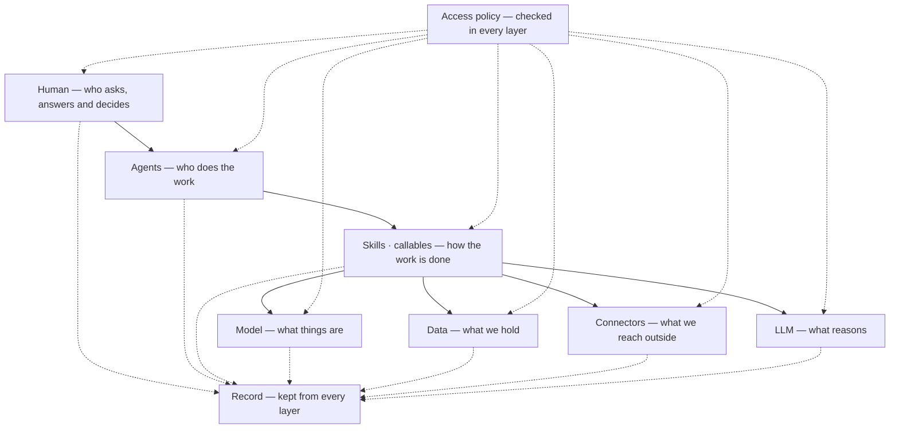
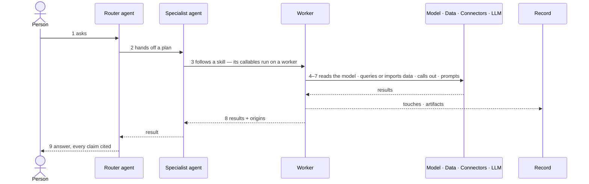
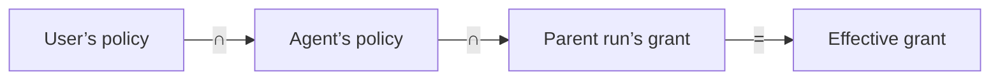
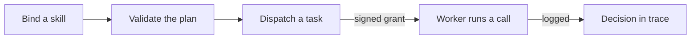
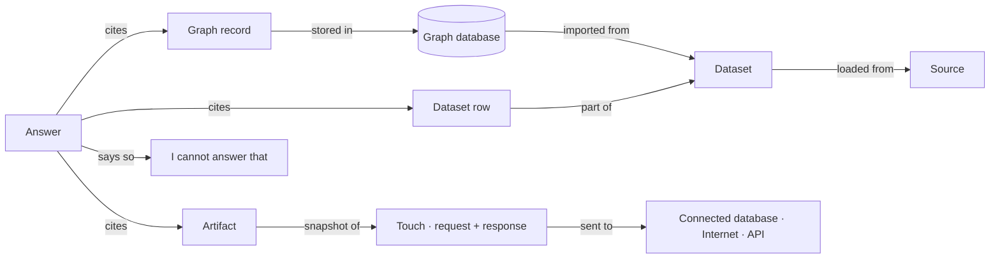
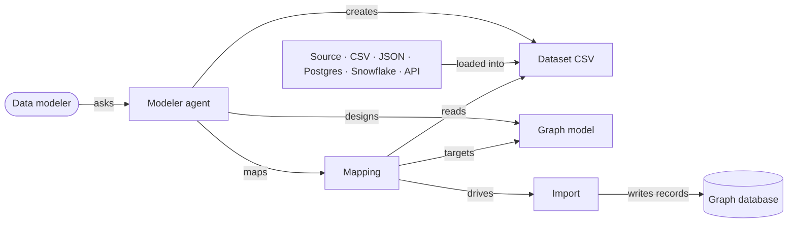
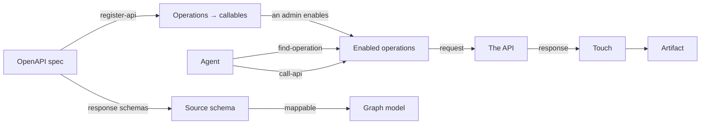
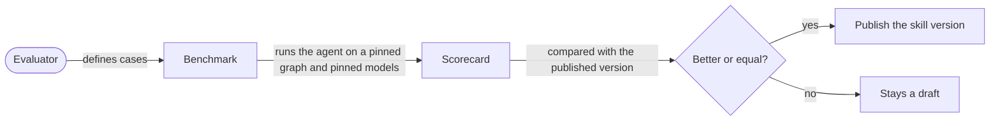

# Agent system — system design

> **Agents answer only from what the system holds or has recorded, and every act is governed and
> traced.** A person asks; a router agent hands the work to the agent that fits; that agent follows a
> skill whose callables run on a worker, anywhere. Every call is checked against access policy, every
> touch is recorded, and every claim in an answer points to its origin — a graph record, a dataset
> row, or an artifact snapshot of what an outside source returned.

| | |
|---|---|
| Status | Design. Nothing here is built unless the [backend architecture](#10-backend-architecture) marks it built. |
| Diagrams | [`agent-system-paths.drawio`](agent-system-paths.drawio) — three pages: **Agent system paths** (the board), **Entity detail**, **Backend architecture** |
| Words | [`../for-developers/terminology.md`](../for-developers/terminology.md), with the departures listed in [§13](#13-conflicts-to-resolve) |

---

## 1. Goals

Two goals. Everything else in this design is how they are built.

| Goal | Means |
|---|---|
| **Trust** | Every answer and every decision can be traced back to the data it used. |
| **Privacy** | You can see what data your LLMs are given, and what they produce. |

### Trust — how it is built

| Component | Records |
|---|---|
| Runtime | On every run: the plan, the skill versions offered, the policies in force |
| Data service · connector gateway | On every read: what came back — record ids, rows, or the response |
| Artifact service | Every outside response, stored as an artifact |
| Import pipeline | On every write: the run and the time that wrote it |
| LLM gateway | Every prompt and completion |
| Answer | Each claim, linked to the record, row or artifact it came from. No source, no claim — the answer says it cannot answer |

| Limit | |
|---|---|
| An LLM may answer differently if asked again | We keep what it said and what it was shown — not a promise it will say the same |
| The graph is not versioned | A past read is checked against the records it returned, not against the graph as it is now |

### Privacy — how it is built

| Component | Records, for every prompt |
|---|---|
| LLM gateway | Provider, model, tokens, the prompt as sent, the completion |
| | Which model types and properties it was shown |
| | Which records, dataset rows and artifacts it was shown |
| Data service | Values written from an LLM's output are marked `origin = llm` |

| Limit | |
|---|---|
| It shows; it does not block | Rules on what an LLM may see come later |

### What must hold for both

| Rule | Why |
|---|---|
| Every LLM call goes through the LLM gateway — provider keys live only there | A call around it is a call nobody saw |
| Every data read and outside call goes through the data service or the connector gateway | Same reason, for data |
| Callables reach the network only through those gateways | Without this, the two rules above are a convention, not a control |

## 2. Layers

Every act passes down through seven layers. **Access policy** and the **record** are not layers — they
cut across all of them.

| Layer | Holds | Policy actions | Recorded |
|---|---|---|---|
| **Human** | User · Data modeler · Operator · Builder · Evaluator · Admin · Platform engineer — and what they answer: a clarification, an approval, a verdict | `agent:invoke` · `human:answer` | on behalf of · the decision |
| **Agents** | Router · Analyst · Research · Modeler · Coder · Judge | `agent:invoke` · `agent:delegate` | runs · handoffs |
| **Skills · callables** | Skill · Callable · Worker | `skill:offer` · `callable:run` | run frames |
| **Model** | Graph model · Dataset schema · Source schema · Mapping | `model:read` · `schema:write` | model versions |
| **Data** | Graph data · Datasets (CSV) | `data:read` · `data:write` | touch — rows, records |
| **Connectors** | Postgres · Snowflake · OpenAPI · MCP · Airbyte · Web search · Files · Mail | `connector:read` · `connector:send` | touch — request, response — and an artifact |
| **LLM** | Anthropic · OpenAI · a local model | `llm:prompt` | prompt, completion, tokens — and what it was shown |

## 3. The flow

| # | Step | From → to | What happens |
|---|---|---|---|
| 1 | asks | Human → Agents | A user asks the router; a data modeler asks the modeler |
| 2 | hands off | Agents → Agents | The router hands a plan, context and a budget slice to the agent that fits |
| 3 | follows a skill | Agents → Skills · callables | The agent follows a skill; its callables run on a worker |
| 4 | reads · designs the model | → Model | Read the graph model — or design it, and map a dataset onto it |
| 5 | queries · imports | → Data | Query the knowledge graph or a dataset; an import writes mapped records |
| 6 | fetches · sends | → Connectors | Reach outside through a connector; the response is kept as an artifact |
| 7 | prompts | → LLM | The LLM reasons over what was found |
| 8 | results + origins | → Agents | Every result comes back with where it came from |
| 9 | answer, cited | Agents → Human | Every claim cites its origin — or the answer says it cannot answer |

Every step is checked against access policy and kept in the record.

## 4. Entities

| Layer | Entity | Is |
|---|---|---|
| Human | **User** · **Data modeler** · **Operator** · **Builder** · **Evaluator** · **Admin** · **Platform engineer** | The personas — [§12](#12-personas-and-their-pathways) |
| Agents | **Router agent** | Classifies the ask, picks the agent and the skills to offer it, composes the answer |
| Agents | **Specialist agent** | Analyst · Research · Coder — receives handoffs |
| Agents | **Modeler agent** | Designs models, creates datasets, maps them, imports them |
| Skills · callables | **Skill** | A playbook offered to an agent; one version is drawn as one plan |
| Skills · callables | **Callable** | One action, one bound — a `@callable` Python function |
| Skills · callables | **Worker** | A process that leases tasks and runs callables — in the engine or on your machine |
| Model | **Graph model** | Node and edge types, versioned |
| Model | **Dataset schema** · **Source schema** | The typed columns of a dataset, or of a connected source or API response |
| Model | **Mapping** | Dataset or source columns → graph model types and properties |
| Data | **Graph database** | The knowledge graph |
| Data | **Dataset** | A CSV, one immutable file per version — [§8](#8-models-and-data) |
| Data | **Import** | Validates rows against a mapping, then writes records |
| Connectors | **Sources** · **Internet · APIs** | What a connector reaches |
| Record | **Run** · **Trace** · **Touch** · **Artifact** · **Answer** · **Dashboard** · **Scorecard** | [§7](#7-record-and-provenance) |
| Cross-cutting | **Access policy** | [§6](#6-access-policy) |

## 5. Agents, skills and callables

**A skill uses many callables; a callable serves many skills.** The relationship runs through the plan.

| Level | Is | Holds |
|---|---|---|
| Skill version | A playbook offered to an agent | Exactly one TaskPlan |
| TaskPlan | A flow of steps | Many Tasks |
| Task | One step | Exactly one callable, named by its `step_key` |
| Callable | One action, one bound | Used by any number of plans |

| Agent | Skills |
|---|---|
| Router | `classify-ask` · `clarify` · `hand-off` · `compose-answer` |
| Analyst | `query-graph` · `explore-neighbours` · `read-dataset` · `say-cannot-answer` |
| Modeler | `design-model` · `version-model` · `connect-source` · `create-dataset` · `map-dataset` · `validate-records` · `import-dataset` · `stitch-models` |
| Coder | `run-code` |
| Judge | `run-benchmark` · `judge-answer` · `compare-baseline` |
| Any agent, by policy — connector skills | `query-source` · `introspect-source` · `register-api` · `find-operation` · `call-api` · `call-tool` · `sync-stream` · `web-search` · `fetch-file` · `send-mail` |
| Every agent | `cite-source` · `snapshot-artifact` · `ask-approval` |

The full table — what each does, the bound it spends, what it cites — is on the board's **Skills** band.

| Decision | |
|---|---|
| Connector skills are **generic by kind** | `query-source`, `call-api`, `call-tool`, `sync-stream` — not one skill per vendor. A connector supplies a description generated from what it offers |
| A skill is **offered**; a callable is **enforced** | An agent can skip a skill and call its callables directly, so the real bound is on the callable and the data, never on the skill |

## 6. Access policy

**One record says who may do what, on which resource, in every layer.** It replaces the envelope and
the lens, and it covers people as well as agents and workers.

| Part | Means | Example |
|---|---|---|
| **Principal** | who acts | `user/ravi` · `group/analysts` · `agent/modeler` · `worker/pool-gpu` |
| **Action** | what it does | `agent:invoke` · `skill:offer` · `callable:run` · `data:read` · `connector:send` · `human:answer` |
| **Resource** | on what | `skill/import-dataset@3` · `callable/write_records` · `graph/neo4j/airways/Supplier` · `mail/acme.com` |
| **Condition** | only when | `args.model = Supplier` · `tokens ≤ 50k` · `pool = on-prem` |
| **Effect** | the answer | `allow` · `deny` — deny always wins |

### How a grant is made

An agent never does more than the person it acts for, and a delegated child never more than its parent.

### Where it is checked

| Gate | Checks |
|---|---|
| Bind a skill | `skill:offer` — may this agent be offered it |
| Validate the plan | `callable:run` for every step, and the resources each names |
| Dispatch a task | the effective grant, signed for the worker |
| Worker runs a call | the call's arguments against the grant's conditions — on the worker itself |

### When it says no

It is never silent. A denied call either pauses for an **approval** — when a policy names who may
approve — or is **refused**, naming the policy and the bound.

### Every layer, one grammar

| Layer | Resource | Actions | Example condition |
|---|---|---|---|
| Human | `user/…` · `group/…` · `approval/<kind>` | `agent:invoke` · `skill:offer` · `human:answer` | who may use which agent · only the owner approves spend over $50 |
| Agents | `agent/<name>` | `agent:invoke` · `agent:delegate` | child grant ⊆ parent grant · max depth 3 |
| Skills | `skill/<name>@<version>` | `skill:offer` · `skill:edit` · `skill:publish` | publish only with a passing scorecard |
| Callables | `callable/<step_key>` · `bound/<bound>` | `callable:run` | `args.model = Supplier` |
| Model | `model/<name>@<version>` · `schema/<dataset>` | `model:read` · `schema:write` | only a data modeler publishes |
| Data | `graph/<db>/<model>/<type>` · `dataset/<name>` | `data:read` · `data:write` | properties ⊄ {salary, ssn} |
| Connectors | `source/<connection>` · `api/…` · `web/…` · `mail/…` | `connector:read` · `connector:send` | `mail.to` ends with `@acme.com` |
| LLM | `llm/<provider>/<model>` | `llm:prompt` | provider allow-list · tokens ≤ 50k per run |
| Workers | `worker/<pool>` | `worker:lease` · `code:exec` | `code:exec` only on `pool = sandbox` |
| Record | `run/…` · `trace/…` · `artifact/…` | `record:read` · `record:export` · `record:delete` | artifacts holding personal data are read by their owners only |
| Platform | `policy/…` · `worker/…` | `policy:edit` · `worker:enrol` | admins only |

| Decision | |
|---|---|
| Who answers a pause is granted apart from who may ask | The asker answers their own clarification by default; an approval needs `human:answer` on `approval/<kind>`; a verdict is never given by the agent that did the work |
| Budget and token caps are conditions | One grammar, not a second record |
| A remote worker receives a **signed grant** | It cannot be trusted to check its own permissions |

## 7. Record and provenance

| Record | Is |
|---|---|
| **Run** | One execution; a handoff opens a child run |
| **Trace** | Run frames, events, logs, metrics and every policy decision |
| **Touch** | One engagement with anything outside the agent: the request sent, the response received, timing, volume |
| **Artifact** | A stored snapshot of a response — the origin a claim cites when the source is outside |
| **Answer** | The composed reply; every claim carries its origin |

### Every claim traces to its origin

## 8. Models and data

| Decision | |
|---|---|
| **A dataset is a CSV**, one immutable file per version, in object storage | No new database in the stack. A citation to "row 42" stays true because the file never changes |
| **The schema lives beside it**, in the Model layer | A CSV has no types; the dataset schema types every column |
| **Queried with DuckDB inside the worker** | A library, not a service |
| **Size cap: 100k rows or 50 MB** | Larger is connected as a source — their Postgres or Snowflake — not uploaded |
| **A dataset is held; a connected source is reached** | A dataset row is its own origin. A live read of a connected source is a touch plus an artifact, because the rows may change after |
| **Both schemas are mappable** | Dataset schemas and source schemas sit in the Model layer, so a source can be mapped to a graph model before deciding to import it |

## 9. Connectors

**One contract, several adapters.** The gateway does what must be the same for every connector; an
adapter only speaks its protocol. The gateway is a **library**: the same code runs in the engine and in
the Worker SDK, so a remote worker reaching a source inside its own network still enforces policy,
records the touch and snapshots the response.

| The gateway, for every connector | The adapter |
|---|---|
| checks policy — `connector:read` / `connector:send` and conditions | speaks the protocol |
| fetches credentials from the secret store | lists what it offers — tables, operations, tools, streams |
| records the touch — request, response, timing | runs the call |
| snapshots the response as an artifact | |
| timeouts · rate limits · redaction | |

| Adapter | For | Becomes | Order |
|---|---|---|---|
| **Native** — Postgres · Snowflake · web search · files · mail | Live, read-only queries we control | Callables declared in the package | First |
| **OpenAPI** | Any API with a spec | One callable per operation | Second |
| **MCP** | Existing tool servers | One callable per enabled tool | Third |
| **Airbyte** | Bulk copy from many sources | An **import** into a dataset CSV — not a live query | Later |

### OpenAPI, end to end

| Decision | |
|---|---|
| `GET` is `connector:read`; every other method is `connector:send` and starts disabled | A spec cannot widen what an agent may do until an admin enables it |
| `find-operation` searches operations by what they do | The agent never loads a two-thousand-operation spec |
| Response schemas become source schemas | An API can be mapped onto a graph model and imported like any source |
| An MCP tool's `readOnlyHint` sorts it into read or send; no hint means send | Same rule as OpenAPI |
| Airbyte cites the **dataset row** it produced; a live connector cites the **artifact** | They differ in kind: copying data in vs answering from it |

## 10. Backend architecture

The **engine** decides and records; **workers** do the work, anywhere. Drawn on the **Backend
architecture** page of [`agent-system-paths.drawio`](agent-system-paths.drawio) — solid is built today,
dashed is designed.

| Zone | Components |
|---|---|
| Clients | Studio · invana CLI · API callers and external agents |
| Engine — control plane | API (`/api/v1`, REST + SSE) · **Policy engine** beside every module |
| ↳ Orchestration | Router agent · Agent and skill registry · Runtime · Review · Callable catalogue · Handoff manager |
| ↳ Knowledge | Model service · Data service · Import pipeline · Provenance · Sessions and answers |
| ↳ Gateways | Connector gateway (Native · OpenAPI · MCP · Airbyte) · LLM gateway |
| ↳ Record and quality | Trace and events · Artifact service · Evaluation · Live stream · Telemetry |
| ↳ Scheduling | Scheduler · Worker registry |
| Data plane | Durable queue · Engine workers · Remote worker (Worker SDK · callable packages · local secrets) |
| State | PostgreSQL · Object storage · Graph databases · HyperDX |
| Outside | LLM providers · Customer sources · Internet, APIs and mail |

| Decision | Why |
|---|---|
| Engine workers call out **through the gateways** | One place enforces policy and snapshots every response |
| Remote workers reach customer sources **directly**, in their own network | Data and credentials never leave the machine; the gateway library still governs and records |
| Remote workers **pull** from the queue | Nothing opens an inbound port on a customer machine |
| The queue is **Postgres** | No new service; leases, retries and cron on rows |
| Artifacts and dataset CSVs live in **object storage** | Snapshots can be large; Postgres keeps digests and pointers |

## 11. Evaluation

**A skill edit cannot ship a regression.**

| Decision | |
|---|---|
| Suites pin the graph snapshot and the models | A score moves only when the skill moves |
| Prefer query-checked cases over LLM-judged ones | LLM judges are noisy; a flaky gate gets ignored |
| An uncited claim fails a case | Grounding is graded, not assumed |

## 12. Personas and their pathways

| Persona | Goal | Pathway |
|---|---|---|
| **User** | Ask a question, get an answer it can trust | asks Router → hands off to Specialist → result back → composes Answer → shown to User |
| **Data modeler** | Turn a source into a knowledge graph | asks Modeler → creates Dataset → mapped by Mapping → drives Import → writes Graph database |
| **Operator** | See what ran, what it touched, what it cost | watches Dashboard → opens a Run → reads its Trace |
| **Builder** | Teach the agents a new skill | edits Skill → calls Callable → runs on Worker |
| **Evaluator** | Prove a skill change is not worse | defines cases → Benchmark → Scorecard → gates publish |
| **Admin** | Decide who may do what, everywhere | writes Access policy → attaches to agent · user · worker → checked at every call → logged in Trace |
| **Platform engineer** | Run the work on our own machines | deploys Worker → registers Callables |
| **Agents** (the system) | Do the work inside their bounds, and cite it | Router → Specialist → Skill → Callable → Worker → Graph · Connectors · LLM |

## 13. Conflicts to resolve

This design departs from the current docs in five places. Each needs a decision recorded in the
owning feature file or module spec before code.

| This design | Current docs | Where |
|---|---|---|
| Access policy covers people, agents and workers | Membership is binary — there are no roles | `terminology.md` §2 · `../system-design.md` §1 |
| Access policy replaces the **envelope** and the **lens** | Envelope bounds what an agent may do; lens what a run may see | `terminology.md` §3, §7 · `orchestration.md` §0.9 |
| **Dataset** is a CSV the system holds | *Dataset* is a retired word — records go straight into a model | `terminology.md` §8 |
| **Connectors** reach outside sources and pull data | *Source connector* is reserved; nothing pulls data in today | `terminology.md` §8 |
| Seven layers: Human · Agents · Skills · Model · Data · Connectors · LLM | Five lens layers: graph data · llm · third party · cache · human | `terminology.md` §3 |

## 14. Open questions

| Question | Leaning |
|---|---|
| Reusable policy groups, like managed policies? | Yes — attach a named group, not copies |
| Whose policy stands in for the user on a scheduled run? | The schedule's owner |
| Is cache its own layer? | No — part of Data; a cache hit still cites the original |
| May a connector write back to a source? | Not at first: read and send only |
| Is the connector gateway its own service? | Not until load says so — a library in the engine and the Worker SDK |
| Rules on what an LLM may see | Later — once the record shows what needs a rule |
| Reading the graph as of a past time | Not now; graph reads keep the records they returned |
| Where does a remote worker's artifact live? | In storage inside that worker's network; the engine keeps the digest and a pointer |
